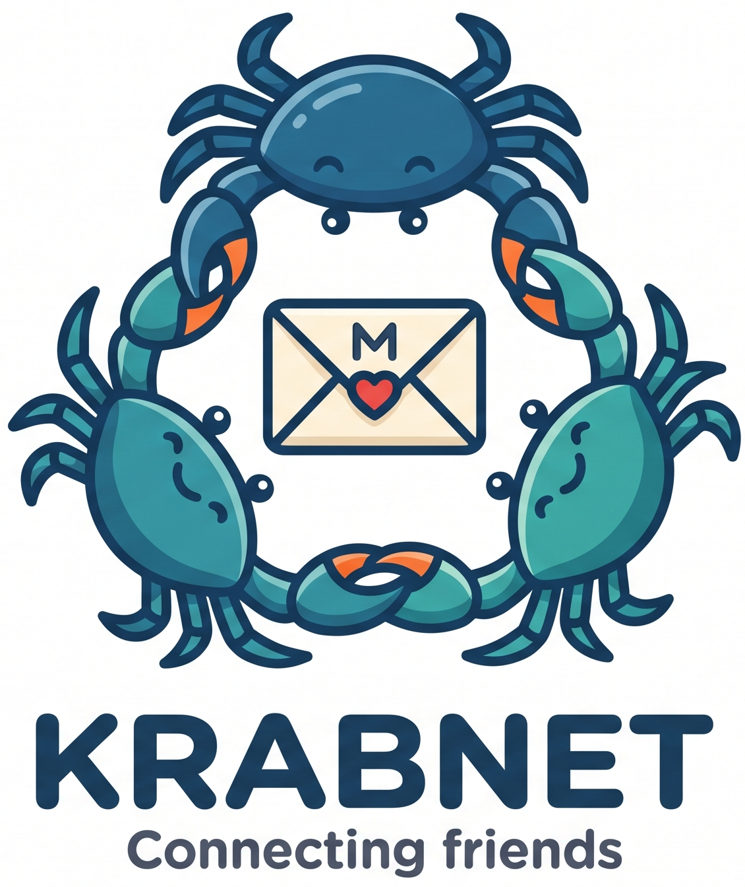

<p align="center">
  
</p>

# Krab

Friend-to-friend, store-and-forward messaging over any transport.

Nodes exchange an encrypted, content-addressed object corpus over whatever
carrier is available — IP, Tor, LoRa, serial, X.25, or a hand-carried USB
stick — with peers chosen individually, out of band, by their operators.

There is no discovery, no directory, no bootstrap server, no proof-of-work,
and no infrastructure of any kind. Admission control is the peering
relationship itself.

Messages are sealed to the recipient's public key and addressed by a
per-epoch unlinkable tag. Relays cannot read a message, determine its
recipient, or identify its sender.

**Krab is FidoNet with modern cryptography.** From FidoNet it takes the
peering model: a hand-maintained peer list, bilateral accountability,
store-and-forward over intermittent links, flood distribution with duplicate
suppression. From Bitmessage it takes the privacy model: an encrypted corpus
every node holds, so possession of an object implies nothing about its
recipient. From neither does it take the scaling assumptions.

## Status

**Planning.** This repository is a scaffold. No RFC in the series is
normative until it reaches Draft and its dependencies are satisfied, and
RFC 1 — the document that freezes the object format permanently — is not
there yet. Nothing here is stable and no wire format exists.

What *is* done is SIM-0, the convergence measurement the whole architecture
rests on, together with an audit of it. See [`Documentation/`](Documentation).

## What Krab is not

Not a replacement for Signal, Matrix, or email. It is slower by orders of
magnitude, cannot be joined without knowing a participant, and makes no
delivery guarantee. It is appropriate where those costs buy something:
operation without infrastructure, resistance to mass passive collection,
resistance to Sybil-based vantage acquisition, and the ability to carry
traffic across links no conventional messenger can use.

It offers no resistance to a global passive adversary. That is out of scope,
explicitly.

## Layout

The split between crates is by dependency direction and is load-bearing
rather than cosmetic — it is what makes deterministic testing, fuzzing, and
headless operation possible.

```
crates/
  krab-core      object format, crypto, tags, filters.
                 no_std, so no I/O, no clock, and no ambient randomness are
                 reachable — the invariant is enforced by the compiler
  krab-store     TTL-bucketed segments, rebuildable index,
                 crypto-shredding key hierarchy
  krab-proto     control messages, reconciliation state machine.
                 pure; property-test and fuzz target
  krab-fabric    Fabric trait and backends: tcp, socks(tor), serial,
                 courier, sim
  krab-node      scheduler, sync loop, key management, peering
  krab           public library facade

apps/
  krab-tui       the TUI application; builds the `krab` binary
  krab-sim       SIM-0/SIM-1 convergence simulator; no dependencies at all
  krab-sizes     RFC 1 reference size encoder; likewise none
```

## Build

    cargo build --release

    ./target/release/krab                        # the node
    ./target/release/krab-sim --diag --sweep mix # SIM-0
    ./target/release/krab-sizes --check          # verify RFC 1's byte counts

The toolchain is pinned and the build is reproducible — two builds of this
source produce the same bytes. Check it yourself:

    ./build-reproducible.sh --verify

## Running a node

Everything is typed into the command pane. There is **no configuration file**:
a file can be lost, spoofed or read, so every decision is a command the
operator gives.

    init                    create the identity — writes down a backup, once
    listen 127.0.0.1:40000  accept inbound links (optional)
    help                    every verb, with what it is for

### Peering with someone

Peering is deliberate and mutual. There is no discovery and no bootstrap
server: **you cannot join Krab without knowing a participant**, which is the
property that makes proof-of-work unnecessary.

Both ends run the same steps; neither is the initiator.

    peer offer                      write your card
    peer pad theirs.pad             your half of the reservoir
    ...exchange both files...
    peer accept their.card          read theirs, and read the words aloud
    peer verified <peer>            record that the fingerprints matched
    peer seal their.pad in-person   finish, and say how it travelled
    peer countersign <file>         both signatures on the credential

Step two of RFC 3 §11 — comparing the fingerprint word lists **aloud** — is the
security step. Everything else is bookkeeping around it.

For two people who cannot meet, `peer meet <addr>` does first contact over a
link, and `peer wrap` carries the reservoir under a key read over a phone call.
Both record what they cost: a peering formed over a network is not
post-quantum until `peer reseal`.

### Sending

    message <peer> [peer…]   compose; Ctrl-D seals and queues
    send <peer> <text>       one line, from the command line
    peers                    who you peer with, and the evidence

### When someone is at the door

    Ctrl-L                   lock, from any mode, including mid-composition
    wipe                     RFC 7 §10's panic destruction

Lock is one keystroke and asks nothing. `wipe` destroys every key this node
holds, overwriting before unlinking, and cannot be undone.

## What this release is, and is not

0.1.0 ships with **RFC 1 §12's vector gate recorded unmet** — it requires two
independent implementations to agree, and there is one. RFC 1 does not reach
Final on this release. [`CHANGELOG.md`](CHANGELOG.md) says what stands in its
place and what that is worth.

The cryptographic review is self-review. Twelve adversarial passes are recorded
in [`Documentation/ADVERSARIAL-PASS.md`](Documentation/ADVERSARIAL-PASS.md),
including what each found after the code had shipped — which is the honest
measure of how much the earlier ones missed.

## Documentation

- [`Documentation/SIM-0-results.md`](Documentation/SIM-0-results.md) — the
  convergence measurements RFC 0 cites
- [`Documentation/SIM-0-audit.md`](Documentation/SIM-0-audit.md) — audit of
  those measurements. Three published columns do not mean what their names
  suggest; read this before citing any figure

## Licence

MIT. See [LICENSE](LICENSE).
